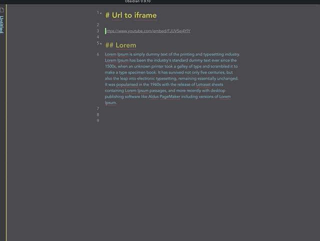

# Obsidian Plugin: Convert an url (ex, youtube) into an iframe (preview)
**Transform an youtube url into a youtube preview.**

Transform a selected url to an embed view if the website allows it. It offers the possibilitiy to resize the preview.

The default hotkey is `cmd + shift + i`.

# Installation
Support for 3rd party plugins is enabled in settings (Obsidian > Settings > Third Party plugin > Safe mode - OFF)
To install this plugin, download zip archive from GitHub releases page. Extract the archive into <vault>/.obsidian/plugins.

# Future improvement
- Find a way to detect when the website doesn't allow cross origins.
- Support more websites.